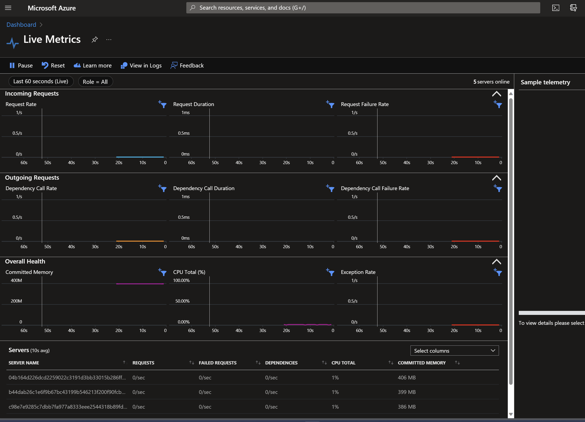

# azfunc-demo

## Security

- <https://learn.microsoft.com/en-us/azure/azure-functions/security-concepts?tabs=v4>

- <https://learn.microsoft.com/en-us/azure/api-management/api-management-howto-oauth2>

- <https://learn.microsoft.com/en-us/azure/api-management/api-management-howto-protect-backend-with-aad>

- verify JWT token : <https://github.com/Azure-Samples/ms-identity-python-webapi-azurefunctions/blob/master/Function/secureFlaskApp/__init__.py>

- verify JWT token (this one has cache on getting openid config and jwk keys): <https://github.com/GeneralMills/azure-ad-token-verify>

- request headers auto injected by Azure App Service (not for azfunc): <https://learn.microsoft.com/en-us/azure/app-service/configure-authentication-user-identities#access-user-claims-in-app-code>

## Demo: Deploy serverless APIs with Azure Functions, Logic Apps, and Azure SQL Database

<https://learn.microsoft.com/en-us/training/modules/deploy-backend-apis/>

## Python developer guide for Azure Functions

<https://learn.microsoft.com/en-us/azure/azure-functions/functions-reference-python?tabs=asgi%2Capplication-level&pivots=python-mode-decorators#folder-structure>

## Blueprints

- <https://learn.microsoft.com/en-us/azure/azure-functions/functions-reference-python?tabs=asgi%2Capplication-level&pivots=python-mode-decorators#blueprints>

- <https://github.com/Azure/azure-functions-durable-python/tree/dev/samples-v2/blueprint>

## Web frameworks (Flask, FastAPI)

<https://learn.microsoft.com/en-us/azure/azure-functions/functions-reference-python?tabs=asgi%2Capplication-level&pivots=python-mode-decorators#web-frameworks>

## Private Python packages

<https://learn.microsoft.com/en-us/azure/azure-functions/functions-reference-python?tabs=asgi%2Capplication-level&pivots=python-mode-decorators#remote-build-with-extra-index-url>

## Async

<https://learn.microsoft.com/en-us/azure/azure-functions/python-scale-performance-reference#async>

## Instances SKUs

Premium plan: <https://learn.microsoft.com/en-us/azure/azure-functions/functions-premium-plan?tabs=portal#available-instance-skus>

## Event grid batch delivery

- <https://learn.microsoft.com/en-us/azure/event-grid/edge/delivery-output-batching>

- <https://learn.microsoft.com/en-us/azure/event-grid/edge/delivery-output-batching>

## Choose between Azure messaging services - Event Grid, Event Hubs, and Service Bus

- <https://learn.microsoft.com/en-us/azure/service-bus-messaging/compare-messaging-services>

- <https://azure.microsoft.com/en-us/blog/events-data-points-and-messages-choosing-the-right-azure-messaging-service-for-your-data/>

- <https://learn.microsoft.com/en-us/azure/architecture/guide/technology-choices/messaging>

- <https://www.reddit.com/r/AZURE/comments/xwh5xs/comment/ir7elhb/?utm_source=share&utm_medium=web3x&utm_name=web3xcss&utm_term=1&utm_content=share_button>

- Blob storage events: <https://docs.microsoft.com/en-us/azure/storage/blobs/storage-blob-event-overview>

- Blob storage triggers: <https://docs.microsoft.com/en-us/azure/azure-functions/functions-bindings-storage-blob-trigger?tabs=python>

    ```python
    import logging
    import azure.functions as func

    app = func.FunctionApp()

    @app.function_name(name="BlobTrigger1")
    @app.blob_trigger(arg_name="myblob",
                    path="PATH/TO/BLOB",
                    connection="CONNECTION_SETTING")
    def test_function(myblob: func.InputStream):
    logging.info(f"Python blob trigger function processed blob \n"
                    f"Name: {myblob.name}\n"
                    f"Blob Size: {myblob.length} bytes")
    ```

    > [!WARNING]
    > [Official doc](https://learn.microsoft.com/en-us/azure/azure-functions/functions-bindings-storage-blob-trigger?tabs=python-v2%2Cisolated-process%2Cnodejs-v4&pivots=programming-language-python#decorators) says: `source` param in `@app.blob_trigger()`: Sets the source of the triggering event. **Use EventGrid for an Event Grid-based blob trigger, which provides much lower latency**. The default is `LogsAndContainerScan` polling system not push, which uses the **standard polling** mechanism to detect changes in the container. See below Low latency Blob trigger using Event Grid for more information.
    **After test, the default trigger seems to be EventGrid but not `LogsAndContainerScan`**.

- Low latency Blob trigger using Event Grid:
    1. <https://learn.microsoft.com/en-us/azure/azure-functions/functions-event-grid-blob-trigger?tabs=isolated-process%2Cnodejs-v4&pivots=programming-language-python>
    2. <https://learn.microsoft.com/en-us/azure/azure-functions/functions-bindings-storage-blob-trigger?tabs=python-v2%2Cisolated-process%2Cnodejs-v4&pivots=programming-language-python#polling-and-latency>

## Storage queues and Service Bus queues - compared and contrasted

<https://docs.microsoft.com/en-us/azure/service-bus-messaging/service-bus-azure-and-service-bus-queues-compared-contrasted>

## Local storage emulator - Azurite

<https://learn.microsoft.com/en-us/azure/storage/common/storage-use-azurite?tabs=visual-studio-code%2Cqueue-storage>

<https://github.com/microsoft/vscode-azurestorage/wiki/Known-Issues>
`sudo apt install libsecret-1-0`

in `local.settings.json`, set `AzureWebJobsStorage` to `UseDevelopmentStorage=true`

## Resources

- az-func-name

    Show func config:

    ```bash
    az functionapp show -n az-func-name -g az-resource-group-name | jq .siteConfig.linuxFxVersion
    ```

    Show appsettings:

    ```bash
    az functionapp config appsettings list -n az-func-name -g az-resource-group-name
    ```

    Load appsettings into `local.settings.json`:

    ```bash
    func azure functionapp fetch-app-settings az-func-name
    ```

- az-sto-account-name

    ```bash
    az storage account show -n az-sto-account-name -g az-resource-group-name --query '[location,sku,kind]' -o tsv
    ```

## Deploy

```bash
func azure functionapp publish az-func-name
```

<details>

<summary>Click to expand `func azure functionapp publish` output</summary>

```bash
    Getting site publishing info...
    [2024-01-07T11:37:03.106Z] Starting the function app deployment...
    Creating archive for current directory...
    Performing remote build for functions project.
    Deleting the old .python_packages directory
    Uploading 94.15 MB [##############################################################################]
    Remote build in progress, please wait...
    Updating submodules.
    Preparing deployment for commit id '20668b5b-1'.
    PreDeployment: context.CleanOutputPath False
    PreDeployment: context.OutputPath /home/site/wwwroot
    Repository path is /tmp/zipdeploy/extracted
    Running oryx build...
    Command: oryx build /tmp/zipdeploy/extracted -o /tmp/build/expressbuild --platform python --platform-version 3.10.4 -i /tmp/8dc0f7512c5ec00 -p packagedir=.python_packages/lib/site-packages
    Operation performed by Microsoft Oryx, https://github.com/Microsoft/Oryx
    You can report issues at https://github.com/Microsoft/Oryx/issues

    Oryx Version: 0.2.20230508.1, Commit: 7fe2bf39b357dd68572b438a85ca50b5ecfb4592, ReleaseTagName: 20230508.1

    Build Operation ID: b1333bad32d4b922
    Repository Commit : 20668b5b-124c-4d41-85cd-28d3dbee0cff
    OS Type           : bullseye
    Image Type        : githubactions

    Detecting platforms...
    Detected following platforms:
    python: 3.10.4
    Version '3.10.4' of platform 'python' is not installed. Generating script to install it...

    Using intermediate directory '/tmp/8dc0f7512c5ec00'.

    Copying files to the intermediate directory...
    Done in 5 sec(s).

    Source directory     : /tmp/8dc0f7512c5ec00
    Destination directory: /tmp/build/expressbuild


    Downloading and extracting 'python' version '3.10.4' to '/tmp/oryx/platforms/python/3.10.4'...
    Detected image debian flavor: bullseye.
    Downloaded in 1 sec(s).
    Verifying checksum...
    Extracting contents...
    performing sha512 checksum for: python...
    Done in 3 sec(s).

    image detector file exists, platform is python..
    OS detector file exists, OS is bullseye..
    Python Version: /tmp/oryx/platforms/python/3.10.4/bin/python3.10
    Creating directory for command manifest file if it does not exist
    Removing existing manifest file

    Running pip install...
    Done in 1 sec(s).
    [11:38:00+0000] Collecting azure-functions
    [11:38:00+0000]   Downloading azure_functions-1.17.0-py3-none-any.whl (165 kB)
    [11:38:00+0000] Installing collected packages: azure-functions
    [11:38:00+0000] Successfully installed azure-functions-1.17.0
    WARNING: You are using pip version 21.2.4; however, version 23.3.2 is available.
    You should consider upgrading via the '/tmp/oryx/platforms/python/3.10.4/bin/python3.10 -m pip install --upgrade pip' command.
    Not a vso image, so not writing build commands
    Preparing output...

    Copying files to destination directory '/tmp/build/expressbuild'...
    Done in 6 sec(s).

    Removing existing manifest file
    Creating a manifest file...
    Manifest file created.
    Copying .ostype to manifest output directory.

    Done in 15 sec(s).
    Writing the artifacts to a Zip file
    Running post deployment command(s)...

    Generating summary of Oryx build
    Deployment Log file does not exist in /tmp/oryx-build.log
    The logfile at /tmp/oryx-build.log is empty. Unable to fetch the summary of build
    Triggering recycle (preview mode disabled).
    Deployment successful. deployer = Push-Deployer deploymentPath = Functions App ZipDeploy. Extract zip. Remote build.
    Remote build succeeded!
```

</details>

## Test

- Local: <http://localhost:7071/api/HttpExample?name=Functions>
- Internet: <https://az-func-name.azurewebsites.net/api/HttpExample?name=Functions>

## Updating app settings

### EnableWorkerIndexing

```bash
az functionapp config appsettings set -n az-func-name -g az-resource-group-name \
    --settings AzureWebJobsFeatureFlags=EnableWorkerIndexing
```

The `AzureWebJobsFeatureFlags` setting with the value of `EnableWorkerIndexing` is used in the context of Azure Functions. This feature flag is particularly relevant for optimizing the behavior and performance of Azure Functions, **especially when dealing with multiple functions in a single function app**.

Here are some key points about `EnableWorkerIndexing`:

1. Function Indexing: Azure Functions uses an indexing process to identify and load available functions within a function app. This process typically happens during the startup of the function app.

2. Worker Role Optimization: When EnableWorkerIndexing is set, it enhances the indexing process. This flag allows the function app to offload the indexing workload to a dedicated worker role, rather than performing it on the primary instance that handles function executions.

3. Performance Improvement: By delegating indexing to a separate worker, the primary instance is less burdened during startup. This can lead to improved performance, especially in scenarios where the function app contains a large number of functions or complex dependencies.

4. Scalability: This feature can be particularly beneficial in a scaled-out environment where multiple instances of a function app are running. It ensures that the indexing load is efficiently managed, contributing to better overall scalability and responsiveness of the function app.

Use Cases: It's most beneficial in complex or large-scale Azure Function deployments, where performance optimization is a priority.

## Verify in Azure

```bash
sudo apt install xdg-utils
func azure functionapp logstream az-func-name --browser
```



```sql
// ---------- incomingRequestsGroupName Queries ----------
// requestRateFriendlyName
let grainTime = 30min;
let grainPerSecond = 30.0 * 60.0; // Rate per second
requests
| where timestamp >= ago(24h)
| summarize ['rate/second'] = sum(itemCount) / grainPerSecond by bin(timestamp, grainTime)
| render timechart

// requestDurationFriendlyName
requests
| where timestamp >= ago(24h)
| summarize ['requests_avg_duration'] = avg(duration) by bin(timestamp, 30min)
| render scatterchart

// requestFailureRateFriendlyName
let grainTime = 30min;
let grainPerSecond = 30.0 * 60.0; // Rate per second
requests
| where timestamp >= ago(24h)
| where success == false
| summarize ['rate/second'] = sum(itemCount) / grainPerSecond by bin(timestamp, grainTime)
| render timechart

// ---------- outgoingRequestsGroupName Queries ----------
// dependencyCallRateFriendlyName
let grainTime = 30min;
let grainPerSecond = 30.0 * 60.0; // Rate per second
dependencies
| where timestamp >= ago(24h)
| summarize ['rate/second'] = sum(itemCount) / grainPerSecond by bin(timestamp, grainTime)
| render timechart

// dependencyCallDurationFriendlyName
dependencies
| where timestamp >= ago(24h)
| summarize ['dependencies_avg_duration'] = avg(duration) by bin(timestamp, 30min)
| render scatterchart

// dependencyCallFailureRateFriendlyName
let grainTime = 30min;
let grainPerSecond = 30.0 * 60.0; // Rate per second
dependencies
| where timestamp >= ago(24h)
| where success == false
| summarize ['rate/second'] = sum(itemCount) / grainPerSecond by bin(timestamp, grainTime)
| render timechart

// ---------- overallHealthGroupName Queries ----------
// committedMemoryFriendlyName
performanceCounters
| where timestamp >= ago(24h)
| where category == "Memory" and name == "Committed Bytes"
| summarize ['performanceCounters_avg_value'] = avg(value) by bin(timestamp, 30min)
| render timechart

// regularAppCpuTitle
performanceCounters
| where timestamp >= ago(24h)
| where category == "Processor" and name == "% Processor Time"
| summarize ['performanceCounters_avg_value'] = avg(value) by bin(timestamp, 30min)
| render timechart

// exceptionRateFriendlyName
let grainTime = 30min;
let grainPerSecond = 30.0 * 60.0; // Rate per second
exceptions
| where timestamp >= ago(24h)
| summarize ['rate/second'] = sum(itemCount) / grainPerSecond by bin(timestamp, grainTime)
| render timechart
```

## Azure Container Apps

<https://learn.microsoft.com/en-us/azure/azure-functions/functions-deploy-container-apps?tabs=acr%2Cbash&pivots=programming-language-python>

```bash
func init --worker-runtime python --docker
```

## Storage

### Check queue content

```bash
export AZURE_STORAGE_CONNECTION_STRING="value should be in the key AzureWebJobsStorage in local.settings.json"

az storage queue list --output tsv

echo `echo $(az storage message get --queue-name test-outqueue-func-xiang -o tsv --query '[].{Message:content}') | base64 --decode`
```

### Set Comos DB settings

```bash
# https://learn.microsoft.com/en-us/azure/azure-functions/functions-add-output-binding-cosmos-db-vs-code?pivots=programming-language-python&tabs=isolated-process%2Cv2#update-your-function-app-settings
az functionapp config appsettings set -n az-func-name -g az-resource-group-name --settings CosmosDbConnectionString='az-cosmos-db-name-connect-string'
```

### Blob trigger

local Ngork endpoint:

<https://380a-2-13-153-57.ngrok-free.app/runtime/webhooks/blobs?functionName=Host.Functions.blob_trigger_event_grid>
